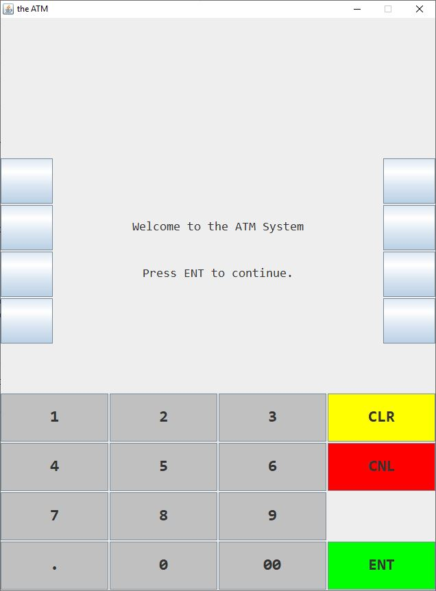

# ATM Emulator
[](https://github.com/RichardLitt/standard-readme)

This is a small project written in Java to emulate the work of an Automated Teller Machine - ATM with GUI.


## Getting Started

The following guide will help you download the project to the local machine and run it.

### Prerequisites

* JRE
* IDE (Optional)

### Installing

1.  Clone or download the project as zip from GitHub.
2.  Create the accounts you want in BankDatabase.java

Example bank accounts
```
accounts[0] = new CurrentAccount(12345, 54321, 1000.0, 1000.0);
accounts[1] = new SavingAccount(98765, 56789, 200.0, 200.0);
```

## Running

Two ways to run the ATM.

### Running in IDE

Run 'ATMCaseStudy.main()'.

### Running in Terminal

Run the following code in terminal under the source code folder.

```
javac *.java
java ATMCaseStudy
```

## Authors

* **Kiros Choi** - *Initial work* - [KirosC](https://github.com/KirosC)

## Acknowledgment

Base on the command line version ATM of

* Deitel & Associates, Inc. and Pearson Education, Inc.